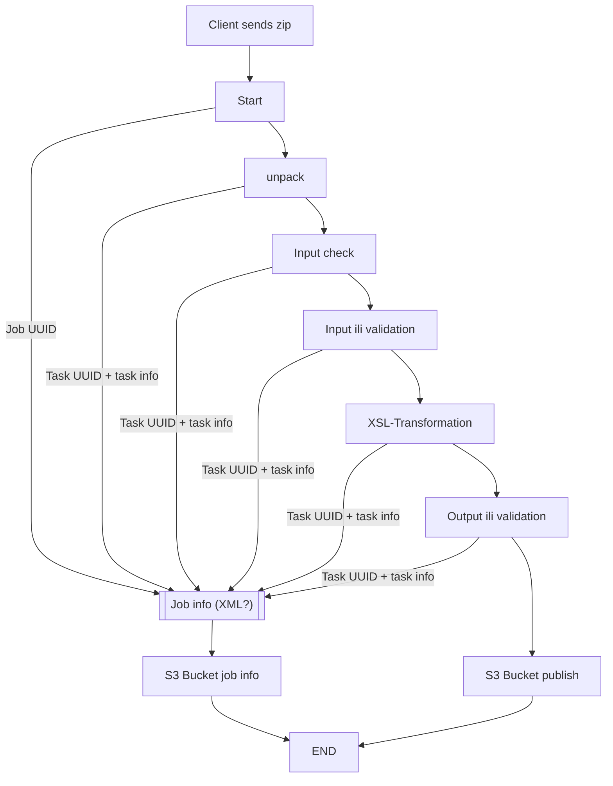
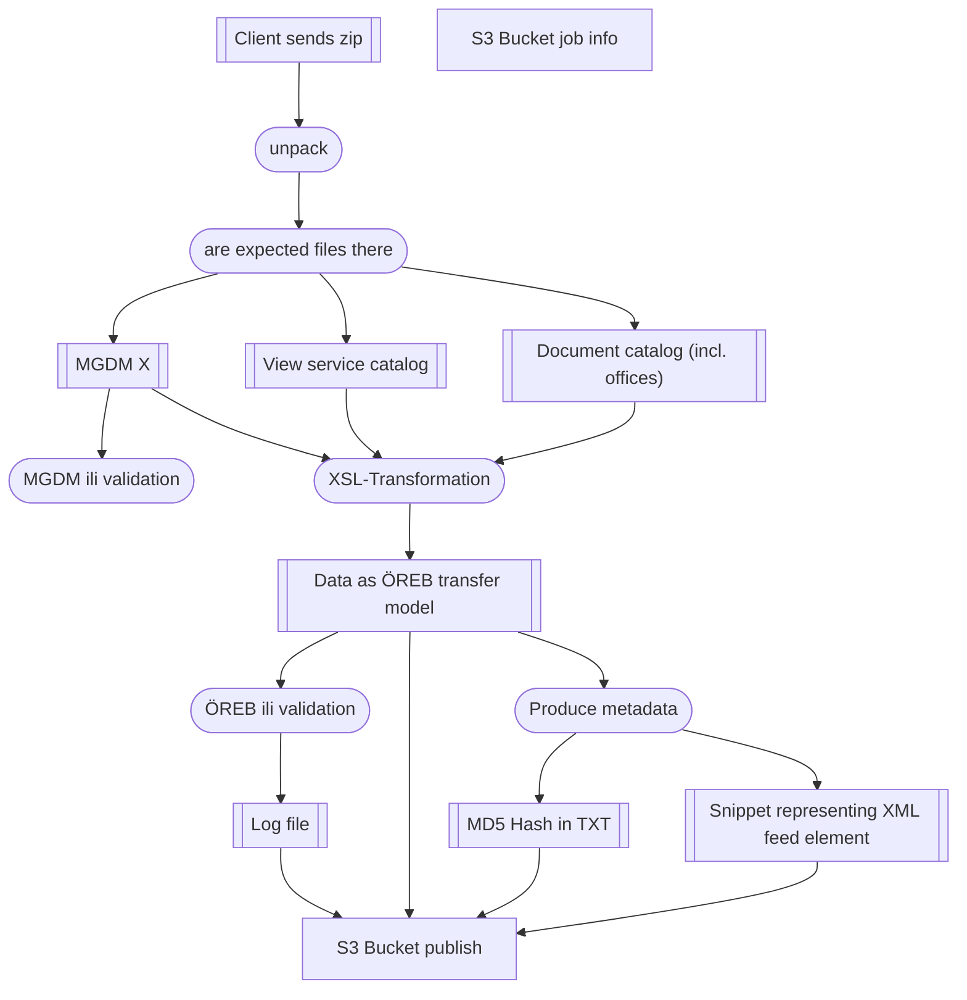
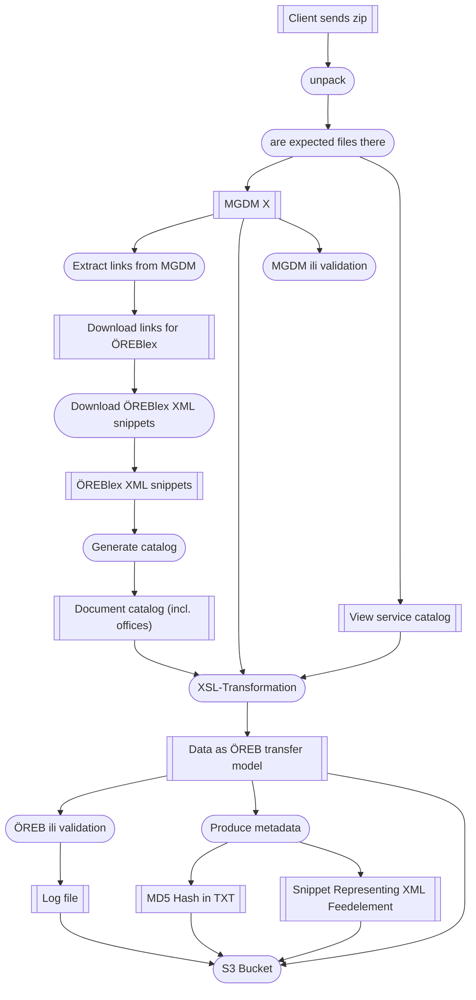

# General

We define the process of transformation in this project as a pipeline (or job) which executes single steps (or task) in a
defined order and composition.

In general the pipline follows this scheme for all datasets:

We see a parallel flow of things happen aside the actual pipelines. This is about keeping track of things.

Each step should write information of input/output and especially errors to a XML file. This file contains the life cycle
of the pipeline in the end and is published to a semi public bucket which exists per user. The XML should be minimalistic
and only be used to get information about the states. It should be wrapped as a snippet for a feed standard (RSS/ATOM) to be
easily merged into a feed by external service. The job info must contain UUID's für the pipeline run and for each task as well.
So these must be generated by Pipeline START and by each task.
A possible addition in later version might also include the artifacts of the tasks to be able to debug failing jobs.

# Pipeline "Client delivers Catalogs"

# Pipeline "Client delivers only links to documents (ÖREBlex)"

